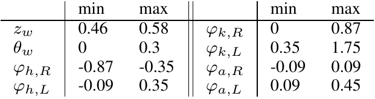
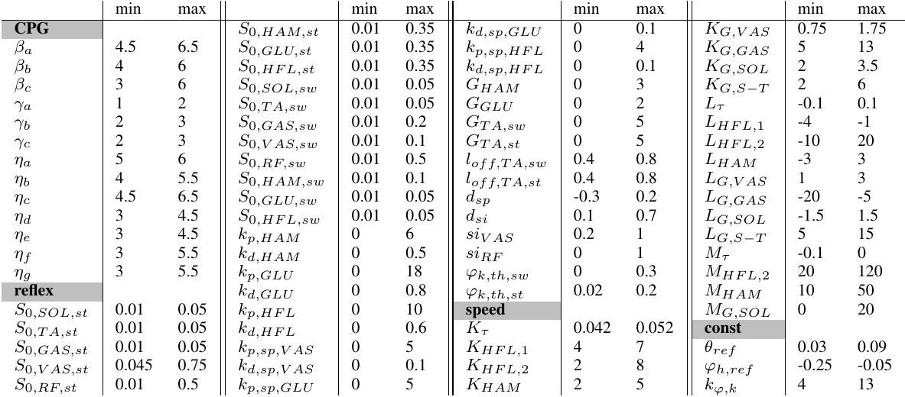

Augmented Neuromuscular Gait Controller Enables Real-time Tracking of Bipedal Running Speed
=========================================

This project supplies the source code related to the bipedal running research done at the BIOROB Laboratory under Dr. Auke Ijspeert at EPFL, and represents the work of Dr. Nicolas Van der Noot, Bruno Somers, and Matthew Harding. The scientific contribution of this work was to demonstrate an adaptable and bio-inspired running-gait control system that can realize a wide range of speeds from a single optimization.

Several figures below summarize the initialization and optimization parameters used in our simulations to attain our results.

<p align="center">
   </br>
   
   </br></br><strong>Table I</strong>: The parameters to be optimized for the biped
initial dynamics state, and their ranges are reported in this table. <i>z</i><sub><i>w</i></sub> is the vertical position of the waist, <i>&theta;</i><sub><i>w</i></sub> its orientation (used to describe the floating base kinematics). <i>φ</i><sub><i>h</i></sub>, <i>φ</i><sub><i>k</i></sub>, <i>φ</i><sub><i>a</i></sub> and <i>φ</i><sub><i>sh</i></sub> are respectively the hip, knee, ankle and shoulder sagittal joint angles (with R and L standing respectively for right and left). It is worthy to note that <i>φ</i><sub><i>sh</i></sub> is computed from left and right leg <i>φ</i><sub><i>h</i></sub>, as shown in the publication. All these initialization parameters' time derivatives (denoted by the •<strong>'</strong> function) are optimized in the [−5; 5] range, except <i>z</i><sub><i>w</i></sub><strong>'</strong> being optimized in the [−0.5; 0.5] range.
</p>


<p align="center">
   </br>
   
   </br></br><strong>Table II</strong>:  The parameters to be optimized in the controller, and their ranges are reported in this table. The speed dependent
parameters are computed as follows: <code>τ = K<sub>τ</sub> + L<sub>τ</sub> v<sub>∗</sub> + M<sub>τ</sub> v<sub>∗</sub><sup>2</sup></code>; <code>k<sub>HFL,1</sub> = K<sub>HFL,1</sub> + L<sub>HFL,1</sub> v<sub>∗</sub></code>; <code>k<sub>HFL,2</sub> = K<sub>HFL,2</sub> + L<sub>HFL,2</sub> v<sub>∗</sub> + M<sub>HFL,2</sub> v<sub>∗</sub><sup>2</sup></code>; <code>k<sub>HAM</sub> = K<sub>HAM</sub> + L<sub>HAM</sub> v<sub>∗</sub> + M<sub>HAM</sub> v<sub>∗</sub><sup>2</sup></code>; <code>G<sub>VAS</sub> = K<sub>G,VAS</sub> + L<sub>G,VAS</sub> v<sub>∗</sub></code>; <code>G<sub>GAS</sub> = K<sub>G,GAS</sub> + L<sub>G,GAS</sub> v<sub>∗</sub></code>; <code>G<sub>SOL</sub> = K<sub>G,SOL</sub> + L<sub>G,SOL</sub> v<sub>∗</sub> + M<sub>G,SOL</sub> v<sub>∗</sub><sup>2</sup></code>; <code>G<sub>S−T</sub> = K<sub>G,S−T</sub> + L<sub>G,S−T</sub> v<sub>∗</sub></code>, where <code>v<sub>∗</sub> = v<sub>ref</sub> − 1.5</code> and </code>v<sub>ref</sub></code> is the target forward speed.
</p>


This repository contains different models of COMAN, our robot platform of choice for our simulations, which one can learn more about [here](https://www.youtube.com/watch?v=oXBYZxa25vc).

## Project structure ##

* [animationR](animationR): folder to save the animations and the VRML files of the 3D visualization
    * [pictures](animationR/pictures): pictures of the robot
    * [python](animationR/python): python scripts to generate visualization (CAD...) files for a mesh like GCM (Ground Contact Model)
    * [vrml](animationR/vrml): VRML files (.wrl) for the 3D visualization
* [dataR](dataR): XML files (.mbs) describing the multi-body properties (structure, masses, inertia...) of the different COMAN models, together with visualization information
    * [elem](dataR/elem): .mbs files which can be combined to make bigger .mbs files
    * [index](dataR/index): files where the .mbs indexes are linked to the simulation code
    * [python](dataR/python): python script to combine .mbs files (from [elem](dataR/elem)) in another .mbs file
* [mbsysCopy](mbsysCopy): copies of the files located in the generic *mbsysC* folder, in order to perform optimizations, or to the project in a *standalone* fashion. This is not available for *Windows*.
    * [cmake_aux](mbsysCopy/cmake_aux): auxiliary CMake files
    * [conf](mbsysCopy/conf): configuration files (external libraries paths...)
    * [extra_conf](mbsysCopy/extra_conf): extra configuration files (i.e. not in generic Robotran projects)
    * [extra_win](mbsysCopy/extra_win): extra libraries for *Windows*, not in the generic Robotran files
    * [mbs_common](mbsysCopy/mbs_common): source files common to any Robotran project
    * [mbsyspad](mbsysCopy/mbsyspad): libraries for 3D visualization (not available for *Mac OS*)
* [opti](opti): files used to configure the optimization, not compiled by CMake
    * [config](opti/config): modify [this file](opti/config/OptiParams.cc) to prepare the optimizations (parameters to optimize, together with their bounds)
    * [python](opti/python): python scripts used to prepare the optimizations and extract the results
    * [save](opti/save): folder to save results of previous optimizations
    * [scripts](opti/scripts): scripts to launch the optimizations on the BioRob cluster
* [resultsR](resultsR): results of the simulations
* [symbolicR](symbolicR): symbolic files generated by Robotran, corresponding to different COMAN models
* [userfctR](userfctR): functions with generic prototypes, filled for this project
* [userFiles](userFiles): personal functions for this project
    * [ctrl](userFiles/ctrl): controller, independent from the simulation environment, compatible with the real [COMAN](https://www.youtube.com/watch?v=oXBYZxa25vc) low-level controller, with the [Webots](https://www.cyberbotics.com/overview) simulation environment (work in progress) and with this [Robotran](http://www.robotran.be/) simulation project
        * [impedance](userFiles/ctrl/impedance): impedance controller to maintain balance
        * [io](userFiles/ctrl/io): inputs/outputs of the controller
        * [kinematic](userFiles/ctrl/kinematic): kinematics computation like COM (center of mass) position
        * [lower](userFiles/ctrl/lower): lower-body controller
        * [main](userFiles/ctrl/main): main controller files
        * [states](userFiles/ctrl/states): states of the robot
        * [upper](userFiles/ctrl/upper): upper-body controller
        * [useful](userFiles/ctrl/useful): useful controller functions and classes
    * [interface](userFiles/interface): interface between the [controller](userFiles/ctrl) and the [simulation](userFiles/simu)
        * [ctrl](userFiles/interface/ctrl): example of a simple controller and choice of the controller
        * [gains](userFiles/interface/gains): gains of the low-level controller to track torques or positions. This can be defined in [LowLevelGains.cc](userFiles/interface/gains/LowLevelGains.cc), together with the choice between torque or position control for each joint.
        * [indexes](userFiles/interface/indexes): indexes of the motors and link between the different index lists
        * [io](userFiles/interface/io): inputs/outputs between simulation and controller
        * [main](userFiles/interface/main): main interface files
        * [user](userFiles/interface/user): user controller structure (provided to the controller), can be used to give a speed reference to the controller, thanks to a joystick
    * [simu](userFiles/simu): functions related to the simulation environment
        * [actuators](userFiles/simu/actuators): actuators of the robot
        * [analysis](userFiles/simu/analysis): gait analysis and fitness computation
        * [cpp_int](userFiles/simu/cpp_int): *C++* interface (to be called from *C* code)
        * [forces](userFiles/simu/forces): external forces (ground contact model...)
        * [io](userFiles/simu/io): inputs/outputs of the simulation modules
        * [joints](userFiles/simu/joints): joints of the robot extra gestion
        * [link](userFiles/simu/link): links of the robot (e.g. for the *flex_feet* version)
        * [main](userFiles/simu/main): main files of the simulation modules
        * [stop](userFiles/simu/stop): condition to stop the simulation (robot falling...)
        * [useful](userFiles/simu/useful): useful functions (and classes) to use in the simulation modules
* [workR](workR): folder used to configure and launch the project, thanks to the [CMakeLists.txt](workR/CMakeLists.txt) file.
    * [src](workR/src): main files of the project (the *main* function is located there)


## Doxygen documentation ##

[Doxygen](http://www.stack.nl/~dimitri/doxygen/) documentation can be generated for this project (documentation about *Doxygen* can be found [here](https://www.stack.nl/~dimitri/doxygen/manual/index.html)).

Here are some instructions for [Ubuntu](http://www.ubuntu.com/).

First, install the following libraries:

```
sudo apt-get install doxygen
sudo apt-get install graphviz
```

Then, go in the [doc](doc) folder and launch the following line (where *Doxyfile* was generated with `doxygen -g` in the [doc](doc) folder):

```
doxygen Doxyfile
```

To see the resulting documentation, just open the generated *index.html* file (located in `doc/html/index.html`) with a web browser. 


## Installation ##

The simulation environment is [Robotran](http://www.robotran.be/), using its *C* environment called *MBsysC*. Installation of *MBsysC* is described at the following links, depending on your OS:
* [Linux](http://www.robotran.be/tutorial/install/Linux/MBsysC.html)
* [Mac OS](http://www.robotran.be/tutorial/install/MacOS/MBsysC.html)
* [Windows 32-bit](http://www.robotran.be/tutorial/install/Win32/MBsysC.html)
* [Windows 64-bit](http://www.robotran.be/tutorial/install/Win64/MBsysC.html)

Basic Robotran knowledge can be useful to work on this project. A tutorial for the Robotran *C* features is available [here](http://www.robotran.be/tutorial/modelling/c-code/). This tutorial can also be accessed using [this page](http://www.robotran.be/howto), by clicking on *C/C++*.

According to previous tests, on *Ubuntu*, the compilers *gcc-4.4* and *g++-4.4* are faster to compile (especially when compared to *gcc-4.8* and *g++-4.8*). They can be installed on *Ubuntu* using the following lines:

```
sudo apt-get install gcc-4.4
sudo apt-get install g++-4.4

```

To launch a project using these compilers, the following line can be used (from *workR/build*, see later):

```
cmake -D CMAKE_C_COMPILER=gcc-4.4 -D CMAKE_CXX_COMPILER=g++-4.4 ..
```

In order to use the modules related to the muscle stimulations inversion, the [GLPK](https://www.gnu.org/software/glpk/) library must be installed. This library is already available [here](mbsysCopy/extra_win/glpk) for *Windows*, i.e. no installation is required. On Unix (Linux and Mac OS) systems, go [here](http://ftp.gnu.org/gnu/glpk/) and download the latest release *glpk-X.XX.tar.gz*. Uncompress it and use the following commands:

```
cd glpk-X.XX
./configure
make
sudo make install
```

Finally, set the flag *FLAG_GLPK* to *ON* to use it. This can be configured using `ccmake` or from the [main CMakeLists.txt](workR/CMakeLists.txt).


## Using the simulator ##

The basic use of the simulation project is the same as in other Robotran projects. You can find many useful information using this [link](http://www.robotran.be/tutorial/modelling/c-code/) (already mentioned earlier). Additionally, real-time features are described [here](http://www.robotran.be/tutorial/realtime/).

The following commands can be used to compile and run the project on Unix systems:


```
cd workR
mkdir build
cd build
cmake ..
make -j4
./exe_projectRobotran
```

To configure the project with other settings, you can use `ccmake` instead of `cmake`.

For instance, you can execute the following lines to use the [gdb](http://www.gnu.org/software/gdb/) (or [cgdb](https://cgdb.github.io/)) debugger:

```
cd workR
mkdir debug
cd debug
ccmake ..
>> change the flag FLAG_RELEASE to OFF
make -j4
cgdb exe_projectRobotran
```

With *FLAG_RELEASE* set to *OFF*, you can also use other tools like [valgrind](http://valgrind.org/).

```
valgrind ./exe_projectRobotran
```

By default, the real-time features are activated, except in the *Debug* mode or during an optimization. To manually deactivate these real-time features, set `mbs_dirdyn->options->realtime` to `0` in [simu_run.cc](workR/src/simu_run.cc).

If you want to provide values to the simulation using CMake, you can use *CMAKE_VAR_1*... *CMAKE_VAR_5* defined in the main [CMakeLists.txt](workR/CMakeLists.txt) file.


## COMAN models ##

These are the COMAN models available:

* **init_feet**: COMAN with the initial rounded shapes feet
* **short_feet**: COMAN with short feet designed at EPFL
* **long_feet**: COMAN with long feet designed at EPFL
* **flex_feet**: COMAN with flexible feet (prosthetic feet initially designed for children)
* **short_feet_ball**: *short_feet* version, but with a ball added


The respective xml files describing these models (.mbs) are located inside the [dataR](dataR) folder. Their symbolic files are stored in the [symbolicR](symbolicR) folder. To choose the COMAN version you want to simulate, open the main [CMakelists.txt](workR/CMakeLists.txt) file and change accordingly the string corresponding to *COMAN_VERSION*. 


## C++ code inside C functions ##

While Robotran C functions are only written in C, this project is mostly written in C++. To this end, the C++ code can mainly be found in the [userFiles](userFiles) folder. This C++ code is called from C code using `extern` calls.

To store all the non generic Robotran variables, structures and classes (e.g. custom COMAN simulation variables, controllers classes), we use the structures [user_IO](userfctR/user_IO.h) and [user_model](userfctR/user_model.h).

In [user_IO](userfctR/user_IO.h), we store all the inputs/outputs related the simulation like the simulation options in [SimuOptions](userFiles/simu/io/simu_options/SimuOptions.h), and the optimization class in [optiClass](userFiles/simu/io/opti/functions/OptiClass.hh). For the controller, the options are defined in [CtrlOptions](userFiles/ctrl/io/ctrl_options/CtrlOptions.hh), in a similar way as for [SimuOptions](userFiles/simu/io/simu_options/SimuOptions.h). 

To access to the C++ class [optiClass](userFiles/simu/io/opti/functions/OptiClass.hh), you can use the following lines:

```
#include "OptiClass.hh"
#include "user_IO.h"

OptiClass *optiClass = static_cast<OptiClass*>(mbs_data->user_IO->optiClass);
```


In [user_model](userfctR/user_model.h), we store the class [cppInterface](userFiles/simu/cpp_int/CppInterface.hh), which is the main entry point to the C++ project classes (i.e. nearly all the C++ classes are stored in this class or in one of its descendants).

To access the [cppInterface](userFiles/simu/cpp_int/CppInterface.hh) class from the [mbs_data](mbsysCopy/mbs_common/mbs_struct/mbs_data.h) structure, you can use the following lines:

```
#include "CppInterface.hh"
#include "user_model.h"

CppInterface *cppInterface = static_cast<CppInterface*>(mbs_data->user_model->cppInterface);
```

## Interface between simulation and controller ##

The simulation is performed in [simu_init](userFiles/simu/main/init_loop_end/simu_init.cc), in charge of creating the class [CppInterface](userFiles/simu/cpp_int/CppInterface.hh). In [CtrlInterface](userFiles/interface/ctrl/CtrlInterface.cc) (a child of [CppInterface](userFiles/simu/cpp_int/CppInterface.hh)), the controller is created and stored in `ctrl`, while `simu_ctrl` contains the main class in charge of computing everything around the controller (external forces, gait analysis, fitness function...). Just after, the function [controller_init_interface](userFiles/interface/main/controller_interface.cc) is called to generate the controller IO  structures and the gains of the low-level impedance controller.

During each simulation timestep, the function [simu_controller_loop](userFiles/simu/main/init_loop_end/simu_ctrl_loop.cc) is in charge of calling the function `compute` of [SimuCtrl](userFiles/simu/main/SimuCtrl.cc). After each time interval *PERIOD_CTRL*, this function will call the function [controller_loop_interface](userFiles/interface/main/controller_interface.cc) to set the controller inputs, run one loop of the controller and set the controller outputs to affect the robot actuators (i.e. send appropriate position and/or torque references) to the actuators low-level impedance controller.

Finally, the function [simu_finish](userFiles/simu/main/init_loop_end/simu_finish.cc) will set the computed fitness function and call [controller_finish_interface](userFiles/interface/main/controller_interface.cc) to close the controller interface (and release the memory). Finally, the [CppInterface](userFiles/simu/cpp_int/CppInterface.hh) class memory will be released.

As previously explained, we have three main environments, related to the three folders located in [userFiles](userFiles):
* [ctrl](userFiles/ctrl): controller, independent from the simulation environment
* [interface](userFiles/interface): interface between the [controller](userFiles/ctrl) and the [simulation](userFiles/simu)
* [simu](userFiles/simu): functions related to the simulation environment

Each of them has its own motor indexes numbering, respectively defined in [CtrlIndex.hh](userFiles/ctrl/main/indexes/CtrlIndex.hh), [CoManIndex.hh](userFiles/interface/indexes/CoManIndex.hh) and [SimuIndex.hh](userFiles/simu/main/indexes/SimuIndex.hh). On top of that, [SimuIndex.hh](userFiles/simu/main/indexes/SimuIndex.hh) has other index lists like the sensors and the links. Not all the indexes are used in each simulation, for instance depending on the COMAN model used. Consequently, we use three classes (one for each environment) to store the list of indexes used: these classes are respectively [MotorCtrlIndex](userFiles/ctrl/main/indexes/MotorCtrlIndex.cc), [MotorCoManIndex](userFiles/interface/indexes/MotorCoManIndex.cc) and [ModelSimuIndex](userFiles/simu/main/indexes/ModelSimuIndex.cc).

This system is more complex than a simple header file with different *#define* lists. It also involves a higher memory consumption and extra computational operations (but this is totally negligible). However, this system is way more flexible (useful to have a better modularity with the different COMAN models).

The controller receives inputs in the `Inputs_ctrl` struct, defined in [this file](userFiles/interface/io/controller_io.hh). Your controller purpose is to fill the field `Outputs_ctrl`, defined in the [same file](userFiles/interface/io/controller_io.hh) (more explanation provided in the *Robot actuators* section). A controller example is provided [here](userFiles/interface/ctrl/Example/ExampleCtrl.cc). To modify the controller used, just assign a new controller to the `ctrl` variable in [CtrlInterface.cc](userFiles/interface/ctrl/CtrlInterface.cc).


## Robot actuators ##

The [COMAN](https://www.youtube.com/watch?v=oXBYZxa25vc) actuators are mainly SEAs (Series Elastic Actuators). Each actuator is depicted as a C++ class in [Actuator.cc](userFiles/simu/actuators/Actuator.cc), where you can also find the associated low-level impedance controller (i.e. computing the voltage to send to the motor, to achieve a desired position or torque reference).

Note that the gains of this low-level impedance controller (described in [LowLevelGains.cc](userFiles/interface/gains/LowLevelGains.cc)) are not exactly the same ones as in the real COMAN because we don't know them. Consequently, they were manually tuned. Finally the list of actuators, with their corresponding characteristics (i.e. parameters) are stored in [RobotActuators.cc](userFiles/simu/actuators/RobotActuators.cc).

The actuators update is done through the following generic Robotran functions: [user_Derivative.c](userfctR/user_Derivative.c) (calling the function [compute_actuators_derivative](userFiles/simu/actuators/interface/actuators_interface.cc)) and [user_JointForces.c](userfctR/user_JointForces.c) calling the function [compute_actuators_torque](userFiles/simu/actuators/interface/actuators_interface.cc).

To control the actuators, fill the [LowLevelGains.cc](userFiles/interface/gains/LowLevelGains.cc) file to choose in the `motor_config` function which joints are controlled in position and which ones are controlled in torque. In the same file, you can also modify the low-level controller gains in the `set_gains_position` function (for position control) and in the `set_gains_torque` fucntion (for torque control).

Then, you need to send appropriate position or torque references to each motor. To this end, you need to fill the fields `q_ref` (position reference [rad]) or `Qq_ref` (torque reference [Nm]) in the [Outputs_ctrl](userFiles/interface/io/controller_io.hh) structure. This structure is provided to your `set_outputs` function, as can be seen in this [example](userFiles/interface/ctrl/Example/ExampleCtrl.cc).


## Ground contact model ##

The GCM (Ground Contact Model) is computed in the generic Robotran function [user_ExtForces](userfctR/user_ExtForces.c) calling the function [compute_ext_forces](userFiles/simu/forces/compute_forces.cc). The GCM update state is performed in [SimuCtrl](userFiles/simu/main/SimuCtrl.cc) with `gcm->state_compute()` in the `compute` function. The GCM computation is mainly performed in the class [ComputeGCM](userFiles/simu/forces/meshGCM/main/ComputeGCM.cc) which contains an object representing the ground (`ground`) and an object representing both feet (`whole_feet`). You can assign new values to each of these two fields to modify the ground and/or the robot feet.

In  particular, we define a GCM able to reproduce any ground equation which can be written as `h(x,y)`, where `x` and `y` are cartesian position coordinates (in the inertial frame) and `h` is the corresponding ground height (position along the *z* axis). You just need to define this function, as well as defining its derivatives along the *x* and *y* axes. An example is provided in the class [LinearGround](userFiles/simu/forces/meshGCM/specific_ground/equation/linear/LinearGround.hh) where the ground is flat before increasing linearly with a slope equal to *SLOPE_ALPHA*.

The feet are defined as a mesh of points. Each [WholeFeet](userFiles/simu/forces/meshGCM/specific_whole_feet/flex/WholeFlexFeet.hh) class can include several rigid feet parts (usually two for rigid feet), which are described by the class [ContactFoot](userFiles/simu/forces/meshGCM/specific_foot/generic/ContactFoot.hh). An example of this mesh can be found in the class [ShortFoot](userFiles/simu/forces/meshGCM/specific_foot/rect/ShortFoot.cc). Pay attention that increasing the mesh size can increase the computational simulation time (GCM can be an important part of the computational time in case of huge feet meshes).

Visualization files can be generated using python scripts located in [this folder](animationR/python). This generation is done with [numpy-STL](https://github.com/WoLpH/numpy-stl). [gen_mesh.py](animationR/python/gen_mesh.py) is a generic file which can be called by different python scripts. An example is provided in [this file](animationR/python/gen_expl_ground.py). The output is a STL file (.stl). Using [Blender](https://www.blender.org/), it is then possible to import the STL file, to extrude it, to color it, and finally, to generate a VRML file (.wrl), which can be included in the Robotran 3D visualization.

Another possibility for the GCM is to use the *contactGeom* library, located in [this folder](userFiles/simu/forces/contactGeom). To do this, the file [SimuOptions.c](userFiles/simu/io/simu_options/SimuOptions.c) must be configured to change *gcm_model* from *MESH_GCM_MODEL* to *PRIM_GCM_MODEL* (primitive-based GCM). In the same file, it is possible to activate the flag *body_contact* to use body contacts, using the same library. More information about this library can be found [here](userFiles/simu/forces/contactGeom/contactGeom.md).


## Generating new models ##

The following porcedure can be used to generate new models of the COMAN robot.
* Create the .mbs file of the new version model.
    * This can be done by combining different .mbs files located inside [elem](dataR/elem). To do so, adapt the *Python* script [mbs_gen.py](dataR/python/mbs_gen.py), then use the following commands:
        * cd dataR/python
        * python mbs_gen.py
    * The result will be generated inside [output](dataR/python/output).
    * Place it in the [dataR](dataR) folder.
    * Open it, check that everything is fine, save it (to get Robotran .mbs conventions) and close it.
* Generate the new symbolic files for this .mbs file and place them in a new folder *new_version* inside [symbolicR](symbolicR)
* Go inside *MBsysC/mbs_app/user_file_generation*
    * Create a *build* folder (`mkdir build`), *cd* into it (`cd build`), configure (`cmake ..`) and compile it (`make`).
    * Launch `./Gen_mds_user path_to_mbs user_all_id`
    * Move the created file in the new folder: `mv userfctR/user_all_id.h symbolicR/new_version/`
* Go in the [index](dataR/index) folder, and create the folder *new_version*. Create the related *specific_simu_index.cc* file.
* Generate the *user_kinematics_model.c* file like this:
    * Generate the *accelred* file (*mbs_accelred_new_version.c*) where the F sensors are set for *Position*, *Rotation Matrix* and *Velocity* and place this file in [this folder](userFiles/simu/forces/contactGeom/python).
    * Go inside [the same folder](userFiles/simu/forces/contactGeom/python) and launch `python kinematics_gen.py mbs_accelred_new_version.c ../../../../../symbolicR/new_version/user_kinematics_model.c`
    * Re-generate the *accelred* file, but unckecking *Position*, *Rotation Matrix* and *Velocity* (for computational speed) and place it in *symbolicR/new_version*.
* In [CMakeLists.txt](workR/CMakeLists.txt) change `set( COMAN_VERSION "old_version" )` by `set( COMAN_VERSION "new_version" )`
* Add a new COMAN version name *NEW_NAME* in [SimuOptions.h](userFiles/simu/io/simu_options/SimuOptions.h).
* Add the line `else if (!strcmp(COMAN_VERSION, "new_version")) return NEW_NAME;` in [SimuOptions.c](userFiles/simu/io/simu_options/SimuOptions.c).
* Adapt the files in the [indexes](userFiles/simu/main/indexes) folder ([SimuIndex.cc](userFiles/simu/main/indexes/SimuIndex.cc), [SimuIndex.hh](userFiles/simu/main/indexes/SimuIndex.hh), [ModelSimuIndex.cc](userFiles/simu/main/indexes/ModelSimuIndex.cc) and [ModelSimuIndex.hh](userFiles/simu/main/indexes/ModelSimuIndex.hh)).
* You might also have to adapt the following files:
    * [SensorsInfo.cc](userFiles/simu/io/sensors/SensorsInfo.cc)
    * [ComputeGCM.cc](userFiles/simu/forces/meshGCM/main/ComputeGCM.cc)
    * [LinksRobot.cc](userFiles/simu/link/LinksRobot.cc)
    * [compute_forces.cc](userFiles/simu/forces/compute_forces.cc)
    * [JointsLimitRobot.cc](userFiles/simu/joints/JointsLimitRobot.cc)
    * ...


## Running optimizations ##

This project is configured to be able to easily optimize the controller. To this end, you first need to configure [OptiInputs](userFiles/ctrl/io/opti/OptiInputs.hh) such that you can access the parameters to optimize (e.g. through classes).


The, you need to configure [OptiParams.cc](opti/config/OptiParams.cc) (like a child of [OptiInputs](userFiles/ctrl/io/opti/OptiInputs.hh)). In its `set_opti()` function, you call functions able to modify the parameters to optimize, except that you replace the unknown parameter by `{min_val ; max_val}`, where `min_val` and `max_val` are the bounds of the range available to the parameter to optimize.

For instance, you can use the following line:

```
my_class->set_param_0( {-0.5 ; 2.0} );
```

When this is done, you need to launch a python script to automatically generate the required optimization files ([get_optiParams.cc](userFiles/simu/io/opti/generated/get_optiParams.cc) and [OptiGeneration.cc](userFiles/simu/io/opti/generated/OptiGeneration.cc)), using the following lines:

```
cd opti/python
python opti_gen.py
```

Then, you can test it by setting *OPTI_RUN* to 1 in  [CMakeLists.txt](workR/CMakeLists.txt). The function `get_rnd_OptiClass()` in [opti_gestion.cc](userFiles/simu/io/opti/functions/opti_gestion.cc) will then be called in the [main](workR/src/main.cc) to set random optimized parameters ranging from 0 to 1. You can write a new function to assign non random values to the optimized parameters, using the `optiClass->add_param(param)` function. These optimized parameters (`param`) must always be bounded in the [0 ; 1] range. Indeed, the scaling is done later, thanks to your [OptiParams.cc](opti/config/OptiParams.cc) configuration.

Then, call `simu_run(optiClass)`, which is defined in [simu_run.cc](workR/src/simu_run.cc). This function will return the fitness at the end of the simulation. To configure the fitness computation, modify the class [Fitness](userFiles/simu/analysis/fitness/Fitness.hh).


### BioRob optimizations ###

This project is already configured to run on the [BioRob](http://biorob.epfl.ch/) cluster, using the [Particle Swarm Optimization](https://en.wikipedia.org/wiki/Particle_swarm_optimization) algorithm (PSO). To this end, you need to modify the variables `nb_particles`, `nb_generations`, `BioRob_priority` and `BioRob_token` in [xml_gen.py](opti/python/xml_gen.py). Instructions are provided in this file to fill them.

To run an optimization on the BioRob cluster, you first need to connect to it, using the following lines (this is an example where `user` needs to be replaced by the user EPFL account and the `path` to the folder adapted to the user configuration):

```
ssh user@bioroblinux.epfl.ch
ssh biorobcn1
cd path/coman_nico/workR
git pull origin master
```

If the project *coman_nico* was not already configured on *user@bioroblinux.epfl.ch*, you need to do this instead:

```
ssh user@bioroblinux.epfl.ch
ssh biorobcn1
cd path/
git clone https://gitlab.robotran.be/nvander/coman_nico.git
chmod a+Xr path/coman_nico
```

Then, modify [CMakeLists.txt](workR/CMakeLists.txt) to set *OPTI_RUN* to 2.

Optimizations can now be launched manually, or using a script, as described below.


#### Manual ####

The script *xml_gen.py* is configured to have different optimizations running in the folder *Optis*. In this example, we run an optimization called *first_opti*. You can do this several times with different optimization names to have different optimizations running at the same time.


```
cd coman_nico/workR
mkdir Optis
cd Optis
mkdir first_opti
cd first_opti
cmake ../../
python xml_gen.py
make -j4
screen
optirunner -t 128.178.148.3 *.xml
Ctrl+A+D
```

*Ctrl+A+D* is used to quit a running screen (i.e. the screen is still running). To do it, maintain Ctrl+A, then press D (while Ctrl+A is still pressed). If you want to suppress a screen (i.e. stop it), do *Ctrl+C* instead of *Ctrl+A+D*. Once this is done, you can `exit` the ssh session, the optimization should be running.

To get back the result of an optimization finished, use the following commands:

```
ssh user@bioroblinux.epfl.ch
ssh biorobcn1
cd path/coman_nico/workR/Optis/first_opti
screen -r name_of_screen
Ctrl+C
mkdir results
python biorob_res_gen.py
```

Then, `exit` the ssh session, and go to a folder on your own local computer where you want to extract the results (they were already generated in the *results* folder, using the *results_gen.py* script). Now, use the following line:

```
scp -r user@bioroblinux.epfl.ch:path/coman_nico/workR/Optis/first_opti/results ./
```

#### Using scripts ####

Here, we provide an example to launch three similar optimizations in parallel. Because the PSO algorithm is a heuristic one, you can get different solutions, even starting from similar executables.

```
[On biorobcn1 ...]
cd coman_nico/workR
cp ../opti/scripts/optiBioRob ./
./optiBioRob opti_1 opti_2 opti_3
```

That is enough to launch the optimizations (starting from *biorobcn1*). To extract them when they are finished, you don't even need to connect to *bioroblinux.epfl.ch* or *biorobcn1*: the screens will shut down automatically when they will be finished and the results folder will be automatically filled with the optimization result. Consequently, you just have to launch the script [clusterBiorobExtract](opti/scripts/clusterBiorobExtract) from the location on your computer where you want to extract the results. This script takes as arguments the names of the optimizations to extract, for instance:

```
path/clusterBiorobExtract opti_1 opti_2 opti_3
```

### MPI optimizations ###

This project is also configured to be optimized with [MPI](https://en.wikipedia.org/wiki/Message_Passing_Interface). Most configurations must be done in [mpi_main.cc](workR/src/mpi_main.cc). At the beginning of this file, you can comment `TEST_OPTI` to run a normal optimization (robot optimization) or uncomment it to run a simple test (basic function to test the optimizer). In the same file, the number of generations can be defined with `NB_GENERATION`.

This optimizer uses daughter classes of [EvolOpti](userFiles/simu/opti/EvolOpti.hh), implementing [evolutionary algorithms](https://en.wikipedia.org/wiki/Evolutionary_algorithm). Two specific evolutionary optimizers are currently implemented:
* [CmaesOpti](userFiles/simu/opti/specific_opti/cmaes/CmaesOpti.hh): the *Covariance Matrix Adaptation Evolution Strategy* algorithm ([CMA-ES](https://www.lri.fr/~hansen/cmaesintro.html))
* [PsoOpti](userFiles/simu/opti/specific_opti/pso/PsoOpti.hh): the *Particle Swarm Optimization* algorithm ([PSO](https://en.wikipedia.org/wiki/Particle_swarm_optimization))

Other optimizers can easily be added if needed. To select the optimizer, modify the following line in [mpi_main.cc](workR/src/mpi_main.cc):

```
opti = new XXX(N, nb_gen, nb_part_opti);
```

where `XXX` is the name of the optimization daughter class.

This can already be launched on your personal computer, provided you install *MPI* (installation instructions can be found [here](http://mpitutorial.com/tutorials/installing-mpich2/)).

When this is installed, set `OPTI_RUN` to `3` in the [main CMakeLists.txt](workR/CMakeLists.txt). The new libraries must be found. Correct the installation if needed.

The extraction file is configured to extract results from a folder *workR/Optis/XXX*, where `XXX` can be replaced by any name. Doing so, you can launch several optimizations at the same time. For instance, to prepare two similar optimizations with names *opti_1* and *opti_2*, use the following lines:

```
mkdir workR/Optis
cd workR/Optis
mkdir opti_1 opti_2
mkdir opti_1/results opti_2/results
cd opti_1
cmake ../..
make -j4
cd ../opti_2
cmake ../..
make -j4
```

Then, after compilation, it is possible to launch the project with the following line (inside *workR/Optis/XXX*):

```
mpirun -np N ./dispatcher_opti
```

where `N` should be replaced by the number of cores to use (it can be more than the real number of cores on the machine, in this case, *MPI* will use them in a queue). `N-1` is equal to the number of slaves in charge of computing the fitness (i.e. number of particles), while the master is in charge of managing the optimization population. `N` should be strictly positive.

If you launch one of these two commands:

```
mpirun -np 1 ./dispatcher_opti
./dispatcher_opti
```

then, only one core (the master) will compute the solutions.

In [mpi_main.cc](workR/src/mpi_main.cc), you can adapt the number of particles (`NB_PART`) and the number of generations (`NB_GEN`).

To extract the results, go inside the *workR/Optis/XXX* folder and launch the following command:

```
python mpi_res_gen.py
```

To launch the optimization on the [CECI](http://www.ceci-hpc.be/) clusters, you can read the documentation provided on the [How To's](http://www.ceci-hpc.be/howtos.html), more specifically [here](http://www.ceci-hpc.be/linux.html) for the Linux section. Here are some relevant lines to connect with the [HMEM](http://www.ceci-hpc.be/clusters.html#hmem) cluster:

```
chmod 600 ~/.ssh/id_rsa.ceci
ssh -i ~/.ssh/id_rsa.ceci yourlogin@hmem.cism.ucl.ac.be
```

To this end, you can modify [mpi_run.sh](opti/scripts/mpi_run.sh) (the lines with `#SBATCH`) to define the optimization configurations (number of cores, time expected, e-mail notifications...). If you do not give enough time, you might get an error like `JOB XXX CANCELLED AT XXX DUE TO TIME LIMIT`.

On the *CECI* cluster, you need to synchronize the project with Git. If needed, you can use a *ssh-agent* to avoid wrtiting your account password each time with the following lines:

```
eval $(ssh-agent)
ssh-add ~/.ssh/id_rsa
```

Then, you can use the following lines to manually prepare an optimization (with `OPTI_RUN` set to `3`):

```
module load openmpi/1.5.3/gcc-4.4.4
module load cmake
module load gsl

cd workR
mkdir build
cd build
cmake ..
make -j8
```

Finally, the optimization is launched using the cluster parallelization with this line:

```
sbatch /home/ucl/mctr/nvandernoot/Optis/coman_nico/opti/scripts/mpi_run.sh
```

Alternatively, you can use the script [optiMpiGen](opti/scripts/optiMpiGen) to easily configure, compile and launch several optimizations in parallel with the following lines (example with three optimizations):

```
cd workR
cp ../opti/scripts/optiMpiGen ./
./optiMpiGen opti_1 opti_2 opti_3
```

Using `squeue`, you can check the optimizations waiting to be launched. `sinfo` is used to list the partitions available.

During the optimization process, you can check the fitness evolution running this line:

```
cat workR/Optis/XXX/run.txt
```

When an optimization is done, you can extract the results with the line `python mpi_res_gen.py` in *workR/Optis/XXX*, as mentioned before (`module load python` is first requested).

[](https://www.youtube.com/watch?v=Q5rWo2cP6jg)
